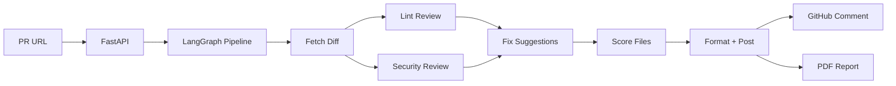

# AI Code Review Agent — Walkthrough

> **Project 3** | Built: March 19, 2026 | Stack: LangGraph · Groq LLama 3.3 · FastAPI · Streamlit · PyGithub

---

## What It Does

Submit a **GitHub PR URL** → the agent fetches the code diff → reviews it for **bugs, security issues, and style** → posts a **structured review comment** on the PR → lets you **download a PDF report**.



---

## Project Structure

```
ai_code_review_agent/
├── .env                          # API keys (Gemini, GitHub)
├── .venv/                        # Virtual environment
├── requirements.txt              # 9 dependencies
├── server.py                     # FastAPI backend (4 endpoints)
├── app.py                        # Streamlit frontend + PDF download
├── agent/
│   ├── state.py                  # LangGraph TypedDict state schema
│   ├── prompts.py                # 4 system prompts
│   ├── nodes.py                  # 8 pipeline nodes
│   └── graph.py                  # StateGraph with parallel edges
├── github_integration/
│   ├── pr_handler.py             # PyGithub: fetch diffs + post comments
│   └── webhook.py                # HMAC-SHA256 verification + event parsing
└── utils/
    ├── helpers.py                # Text truncation utility
    └── pdf_report.py             # Formatted PDF report generator
```

---

## Agent Pipeline — 8 Nodes

| # | Node | What It Does |
|---|------|-------------|
| 1 | [fetch_diff](file:///c:/2026%20AI%20Projects/ai_code_review_agent/agent/nodes.py#71-97) | Parses the PR URL, calls PyGithub to get diff + files |
| 2 | [lint_review](file:///c:/2026%20AI%20Projects/ai_code_review_agent/agent/nodes.py#100-128) | Gemini Flash reviews for style, naming, formatting issues (returns JSON) |
| 3 | [logic_review](file:///c:/2026%20AI%20Projects/ai_code_review_agent/agent/nodes.py#131-159) | Gemini Flash reviews for security vulnerabilities, bugs, logic errors (returns markdown) |
| 4 | [suggest_fixes](file:///c:/2026%20AI%20Projects/ai_code_review_agent/agent/nodes.py#162-213) | Gemini Flash generates before/after code fix suggestions (returns JSON) |
| 5 | [score_files](file:///c:/2026%20AI%20Projects/ai_code_review_agent/agent/nodes.py#216-262) | Gemini Flash scores each file 1–10 with justification (returns JSON) |
| 6 | [format_review](file:///c:/2026%20AI%20Projects/ai_code_review_agent/agent/nodes.py#265-333) | Assembles all results into a structured GitHub-flavored markdown comment |
| 7 | [post_review](file:///c:/2026%20AI%20Projects/ai_code_review_agent/agent/nodes.py#336-350) | Posts the review as a comment on the GitHub PR |

> **Nodes 2 & 3 run in parallel** via LangGraph's parallel edge support for faster reviews.

All LLM calls use [_invoke_with_retry()](file:///c:/2026%20AI%20Projects/ai_code_review_agent/agent/nodes.py#28-46) — auto-retries with exponential backoff (5s → 10s → 20s) on rate limits.

---

## System Prompts

| Prompt | Role | Focus |
|--------|------|-------|
| `SENIOR_SECURITY_ENGINEER_PROMPT` | Security reviewer | OWASP Top 10, injection attacks, auth flaws, crypto misuse, severity-rated findings |
| `LINTER_PROMPT` | Style checker | PEP-8, naming, formatting, dead code, imports (JSON output) |
| `CODE_FIXER_PROMPT` | Fix generator | Generates drop-in code replacements with explanations (JSON output) |
| `SCORER_PROMPT` | Quality scorer | 1–10 rubric: security weight, penalizes critical vulns, rewards best practices |

---

## API Endpoints — [server.py](file:///c:/2026%20AI%20Projects/ai_code_review_agent/server.py)

| Method | Endpoint | Purpose |
|--------|----------|---------|
| `POST` | `/review` | Manual trigger — `{ "pr_url": "..." }` |
| `POST` | `/webhook` | GitHub webhook — auto-reviews on PR open/push |
| `GET` | `/reviews/{owner}/{repo}/{pr_number}` | Fetch cached results |
| `GET` | `/health` | Health check |

---

## Streamlit UI — [app.py](file:///c:/2026%20AI%20Projects/ai_code_review_agent/app.py)

- **PR URL input** with one-click review button
- **Status tracker** showing each pipeline step
- **Metrics dashboard** — overall score, files reviewed, lint count
- **📥 PDF download button** — generates a formatted PDF with date, scores, and findings
- **Per-file expandable cards** with tabbed views:
  - 🧹 Lint Issues
  - 🛡️ Security & Logic
  - 🔧 Suggested Fixes (side-by-side before/after)
- **Full markdown view** of the raw review

---

## PDF Report — [utils/pdf_report.py](file:///c:/2026%20AI%20Projects/ai_code_review_agent/utils/pdf_report.py)

The downloadable PDF includes:
- **Title page**: "AI Code Review Report" + PR name + date/time
- **Color-coded score bars** per file (green/yellow/red)
- **All findings**: lint, security, and fixes formatted for print
- **Page numbers** in the footer

---

## How to Run

```bash
# Terminal 1 — Backend
cd "c:\2026 AI Projects\ai_code_review_agent"
.\.venv\Scripts\Activate.ps1
python -m uvicorn server:app --port 8000

# Terminal 2 — Frontend
cd "c:\2026 AI Projects\ai_code_review_agent"
.\.venv\Scripts\Activate.ps1
streamlit run app.py
```

---

## GitHub Webhook Setup (Auto-Review on PRs)

1. Expose your server: `ngrok http 8000`
2. Go to your repo → **Settings** → **Webhooks** → **Add webhook**
3. **Payload URL**: `https://<ngrok-url>/webhook`
4. **Content type**: `application/json`
5. **Secret**: same as `GITHUB_WEBHOOK_SECRET` in [.env](file:///c:/2026%20AI%20Projects/ai_code_review_agent/.env)
6. **Events**: Select **Pull requests**

Every new PR or push will auto-trigger a review.
